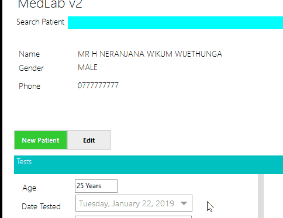

[Download](https://github.com/LKNera/MediLabManagementSystem/releases/download/v1.0/MediLabManagementSystem-release.zip)

# MediLab Management System
Simple system to manage patient data and report details of total blood cell count.

With report generation capabilities

And more . . .

# Pre-requisites

In order to run this application you need to have SQL EXPRESS & .Net 3.5 or newer installed on a windows XP or obove machine

[Download](https://github.com/LKNera/MediLabManagementSystem/releases/download/v1.0/MediLabManagementSystem-release.zip)
